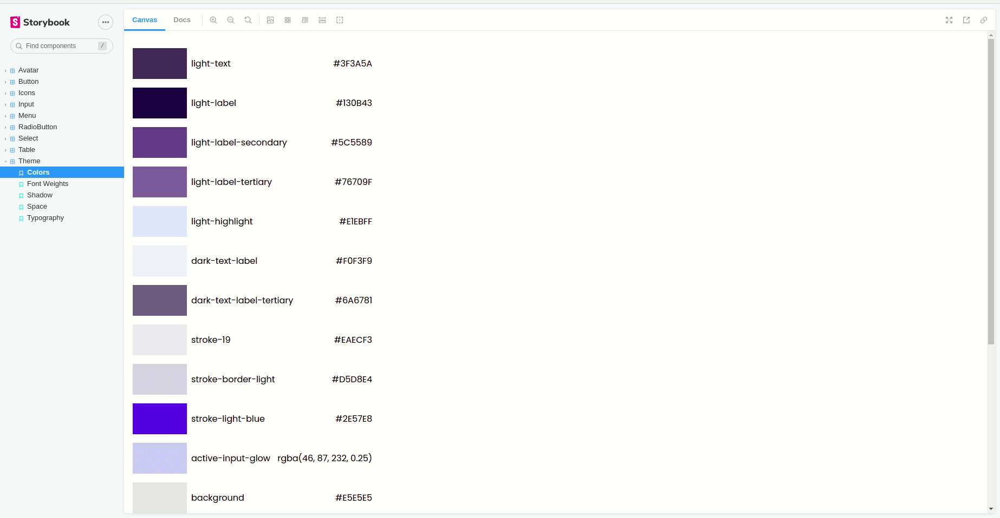

# Exercism Testimonials

A coding challenge to replicate the testimonials page on Exercism page created using React and Typescript.

As I have a figma design access, I decided to go all the way and create a design system via [Storybook](https://storybook.js.org/) to demonstrate what I would've suggested working with them.

## Stack

- [NX](https://nx.dev/) to handle the monorepo while exposing shareable content such as the design system
- [Theme UI](https://theme-ui.com/) to create a consumable theme.
- [Axios](https://axios-http.com/docs/intro)
- [React Query](https://react-query.tanstack.com/) to handle server synchronization
- [Husky](https://typicode.github.io/husky/#/), [Lint Staged](https://www.npmjs.com/package/lint-staged?activeTab=readme) and [Commit Lint](https://commitlint.js.org/#/) following conventional commits

## Design system

## Listing Highlights

- Using a design system to consume components
- Keeping pagination and sorting values in query params and reflect it into filter fields on mount

## Demo

- [Design System](https://exercism-ui.netlify.app/?path=/story/theme--colors)
- [Testimonial List](https://exercism-testimonials.netlify.app/)

## Start

- Run `yarn start` to serve the testimonial list project.
- Run `yarn start:storybook` to serve the design system project.

## Build

- Run `yarn build` to build the testimonial list project.
- Run `yarn build:storybook` to build the design system project.

## Running unit tests

Run `yarn test` to execute the unit tests via [Jest](https://jestjs.io).

Right now the test cases test the following tests:

- `useFilters` custom hook
